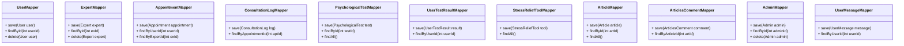

```mermaid

classDiagram
    class UserMapper {
        + save(User user)
        + findById(int userId)
        + delete(User user)
    }

    class ExpertMapper {
        + save(Expert expert)
        + findById(int exId)
        + delete(Expert expert)
    }

    class AppointmentMapper {
        + save(Appointment appointment)
        + findByUserId(int userId)
        + findByExpertId(int exId)
    }

    class ConsultationLogMapper {
        + save(ConsultationLog log)
        + findByAppointmentId(int aptId)
    }

    class PsychologicalTestMapper {
        + save(PsychologicalTest test)
        + findById(int testId)
        + findAll()
    }

    class UserTestResultMapper {
        + save(UserTestResult result)
        + findByUserId(int userId)
    }

    class StressReliefToolMapper {
        + save(StressReliefTool tool)
        + findAll()
    }

    class ArticleMapper {
        + save(Article article)
        + findById(int artId)
        + findAll()
    }

    class ArticlesCommentMapper {
        + save(ArticlesComment comment)
        + findByArticleId(int artId)
    }

    class AdminMapper {
        + save(Admin admin)
        + findById(int adminId)
        + delete(Admin admin)
    }

    class UserMessageMapper {
        + save(UserMessage message)
        + findByUserId(int userId)
    }


```