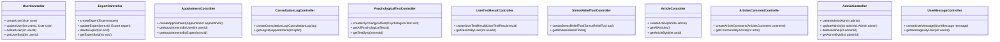

```mermaid
classDiagram
    class UserController {
        + createUser(User user)
        + updateUser(int userId, User user)
        + deleteUser(int userId)
        + getUserById(int userId)
    }

    class ExpertController {
        + createExpert(Expert expert)
        + updateExpert(int exId, Expert expert)
        + deleteExpert(int exId)
        + getExpertById(int exId)
    }

    class AppointmentController {
        + createAppointment(Appointment appointment)
        + getAppointmentsByUser(int userId)
        + getAppointmentsByExpert(int exId)
    }

    class ConsultationLogController {
        + createConsultationLog(ConsultationLog log)
        + getLogsByAppointment(int aptId)
    }

    class PsychologicalTestController {
        + createPsychologicalTest(PsychologicalTest test)
        + getAllPsychologicalTests()
        + getTestById(int testId)
    }

    class UserTestResultController {
        + createUserTestResult(UserTestResult result)
        + getResultsByUser(int userId)
    }

    class StressReliefToolController {
        + createStressReliefTool(StressReliefTool tool)
        + getAllStressReliefTools()
    }

    class ArticleController {
        + createArticle(Article article)
        + getAllArticles()
        + getArticleById(int artId)
    }

    class ArticlesCommentController {
        + createArticleComment(ArticlesComment comment)
        + getCommentsByArticle(int artId)
    }

    class AdminController {
        + createAdmin(Admin admin)
        + updateAdmin(int adminId, Admin admin)
        + deleteAdmin(int adminId)
        + getAdminById(int adminId)
    }

    class UserMessageController {
        + createUserMessage(UserMessage message)
        + getMessagesByUser(int userId)
    }


```