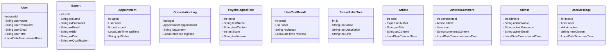

```mermaid
classDiagram
%% direction RL

    %% classGroup Group1
    %% class User
    %% class Expert
    %% class Appointment
    %% end

    %% classGroup Group2
    %% class ConsultationLog
    %% class PsychologicalTest
    %% class UserTestResult
    %% end

    class User {
        - int userId
        - String userName
        - String userPassword
        - String userEmail
        - String userIntro
        - LocalDateTime createdTime
    }

    class Expert {
        - int exId
        - String exName
        - String exPassword
        - String exEmail
        - String exBio
        - String exDire
        - String exQualification
    }

    class Appointment {
        - int aptId
        - User user
        - Expert expert
        - LocalDateTime aptTime
        - String aptStatus
    }
  

    %%<br />
    %% 空行分隔
    class ConsultationLog {
        - int logId
        - Appointment appointment
        - String logContent
        - LocalDateTime logTime
    }

    class PsychologicalTest {
        - int testId
        - String testName
        - String testContent
        - int testScore
        - String testAnswer
    }

    class UserTestResult {
        - int resId
        - User user
        - String resResult
        - LocalDateTime resTime
    }

%% 空行分隔
    class StressReliefTool {
        - int id
        - String toolName
        - String toolDescription
        - String toolLink
    }

    class Article {
        - int artId
        - Expert artAuthor
        - String artTitle
        - String artContent
        - LocalDateTime artTime
    }

    class ArticlesComment {
        - int commentsId
        - Article article
        - User user
        - String commentsContent
        - LocalDateTime commentsTime
    }
%% 空行分隔
    class Admin {
        - int adminId
        - String adminName
        - String adminPassword
        - String adminEmail
        - LocalDateTime createdTime
    }

    class UserMessage {
        - int mesId
        - User user
        - Admin admin
        - String mesContent
        - LocalDateTime mesTime
    }
    
    class User
    class Expert
    class Appointment
    %%
    class ConsultationLog
    class PsychologicalTest
    class UserTestResult
    %%
    class StressReliefTool
    class Article
    class ArticlesComment
    %%
    class Admin
    class UserMessage


```