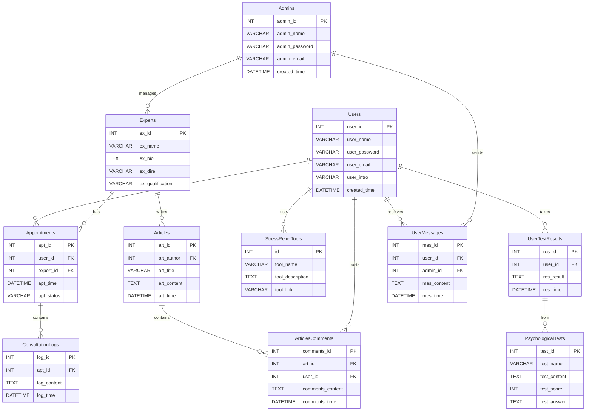

```
<!DOCTYPE html>
<html>
<head>
    <style>
        .er.relationshipLabelBox {
            fill: lightblue; /* 背景颜色 */
            stroke: darkblue; /* 边框颜色 */
            stroke-width: 2px; /* 边框宽度 */
        }
    </style>
</head>
<body>
    <div class="mermaid">
        erDiagram
        CUSTOMER ||--o{ ORDER : places
        ORDER ||--|{ LINE-ITEM : contains
        CUSTOMER {
            string name
            string custNumber
            string sector
        }
        ORDER {
            int orderNumber
            string deliveryAddress
            string orderDate
        }
        LINE-ITEM {
            string productCode
            int quantity
            float pricePerUnit
        }
    </div>
    <script type="module">
        import mermaid from 'https://cdn.jsdelivr.net/npm/mermaid@9/dist/mermaid.esm.min.mjs';
        mermaid.initialize({ startOnLoad: true });

        // 等待 Mermaid 渲染完成后执行代码
        document.addEventListener('DOMContentLoaded', function () {
            document.querySelectorAll('.er.relationshipLabelBox').forEach(function (label) {
                // 获取原来矩形的位置和大小属性
                const x = parseFloat(label.getAttribute('x'));
                const y = parseFloat(label.getAttribute('y'));
                const width = parseFloat(label.getAttribute('width'));
                const height = parseFloat(label.getAttribute('height'));

                // 计算菱形的四个顶点
                const points = [
                    [x + width / 2, y], // 顶点
                    [x + width, y + height / 2], // 右顶点
                    [x + width / 2, y + height], // 底部顶点
                    [x, y + height / 2] // 左顶点
                ].map(point => point.join(',')).join(' ');

                // 创建一个新的菱形元素
                const diamond = document.createElementNS("http://www.w3.org/2000/svg", "polygon");
                diamond.setAttribute('points', points);
                diamond.setAttribute('fill', label.getAttribute('fill'));
                diamond.setAttribute('stroke', label.getAttribute('stroke'));
                diamond.setAttribute('stroke-width', label.getAttribute('stroke-width'));
                diamond.setAttribute('class', 'er.relationshipLabelBox');

                // 将新的菱形元素插入到原来的矩形位置
                label.parentNode.insertBefore(diamond, label);

                // 移除原来的矩形元素
                label.remove();
            });
        });
    </script>
</body>
</html>
```
```
 .rhombus{
            width: 100px;
            height: 100px;
            transform: rotateZ(45deg)skew(30deg,30deg);
            background: blue;
        }
```
<!DOCTYPE html>
<html>
<head>
</head>
<body>
    <div class="mermaid">
        erDiagram
        CUSTOMER ||--o{ ORDER : places
        ORDER ||--|{ LINE-ITEM : contains
        CUSTOMER {
            string name
            string custNumber
            string sector
        }
        ORDER {
            int orderNumber
            string deliveryAddress
            string orderDate
        }
        LINE-ITEM {
            string productCode
            int quantity
            float pricePerUnit
        }
    </div>
    
</body>
</html>

