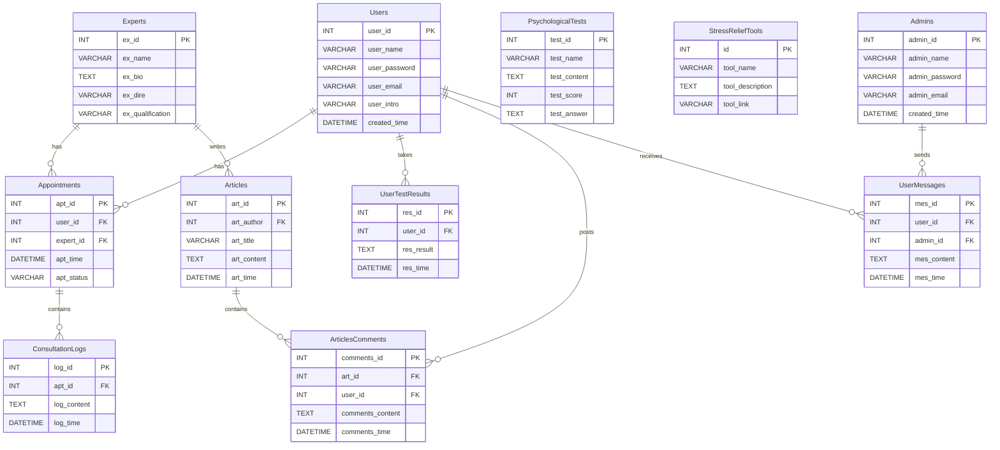

```mermaid
erDiagram
    Users {
        INT user_id PK
        VARCHAR user_name
        VARCHAR user_password
        VARCHAR user_email
        VARCHAR user_intro
        DATETIME created_time
    }
    Experts {
        INT ex_id PK
        VARCHAR ex_name
        TEXT ex_bio
        VARCHAR ex_dire
        VARCHAR ex_qualification
    }
    Appointments {
        INT apt_id PK
        INT user_id FK
        INT expert_id FK
        DATETIME apt_time
        VARCHAR apt_status
    }
    ConsultationLogs {
        INT log_id PK
        INT apt_id FK
        TEXT log_content
        DATETIME log_time
    }
    PsychologicalTests {
        INT test_id PK
        VARCHAR test_name
        TEXT test_content
        INT test_score
        TEXT test_answer
    }
    UserTestResults {
        INT res_id PK
        INT user_id FK
        TEXT res_result
        DATETIME res_time
    }
    StressReliefTools {
        INT id PK
        VARCHAR tool_name
        TEXT tool_description
        VARCHAR tool_link
    }
    Articles {
        INT art_id PK
        INT art_author FK
        VARCHAR art_title
        TEXT art_content
        DATETIME art_time
    }
    ArticlesComments {
        INT comments_id PK
        INT art_id FK
        INT user_id FK
        TEXT comments_content
        DATETIME comments_time
    }
    Admins {
        INT admin_id PK
        VARCHAR admin_name
        VARCHAR admin_password
        VARCHAR admin_email
        DATETIME created_time
    }
    UserMessages {
        INT mes_id PK
        INT user_id FK
        INT admin_id FK
        TEXT mes_content
        DATETIME mes_time
    }

    Users ||--o{ Appointments : has
    Experts ||--o{ Appointments : has
    Appointments ||--o{ ConsultationLogs : contains
    Users ||--o{ UserTestResults : takes
    Articles ||--o{ ArticlesComments : contains
    Users ||--o{ ArticlesComments : posts
    Users ||--o{ UserMessages : receives
    Admins ||--o{ UserMessages : sends
    Experts ||--o{ Articles : writes
```