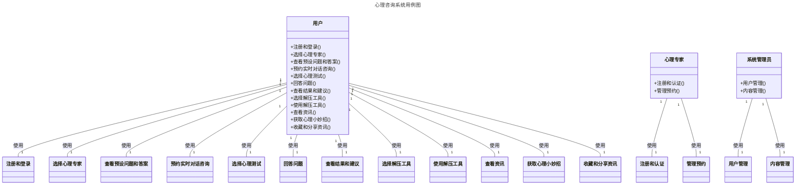

```mermaid
---
title: 心理咨询系统用例图
---
classDiagram
    class 用户 {
        +注册和登录()
        +选择心理专家()
        +查看预设问题和答案()
        +预约实时对话咨询()
        +选择心理测试()
        +回答问题()
        +查看结果和建议()
        +选择解压工具()
        +使用解压工具()
        +查看资讯()
        +获取心理小妙招()
        +收藏和分享资讯()
    }
    class 心理专家 {
        +注册和认证()
        +管理预约()
    }
    class 系统管理员 {
        +用户管理()
        +内容管理()
    }
    用户 "1" -- "1" 注册和登录 : 使用
    用户 "1" -- "1" 选择心理专家 : 使用
    用户 "1" -- "1" 查看预设问题和答案 : 使用
    用户 "1" -- "1" 预约实时对话咨询 : 使用
    用户 "1" -- "1" 选择心理测试 : 使用
    用户 "1" -- "1" 回答问题 : 使用
    用户 "1" -- "1" 查看结果和建议 : 使用
    用户 "1" -- "1" 选择解压工具 : 使用
    用户 "1" -- "1" 使用解压工具 : 使用
    用户 "1" -- "1" 查看资讯 : 使用
    用户 "1" -- "1" 获取心理小妙招 : 使用
    用户 "1" -- "1" 收藏和分享资讯 : 使用
    心理专家 "1" -- "1" 注册和认证 : 使用
    心理专家 "1" -- "1" 管理预约 : 使用
    系统管理员 "1" -- "1" 用户管理 : 使用
    系统管理员 "1" -- "1" 内容管理 : 使用
```